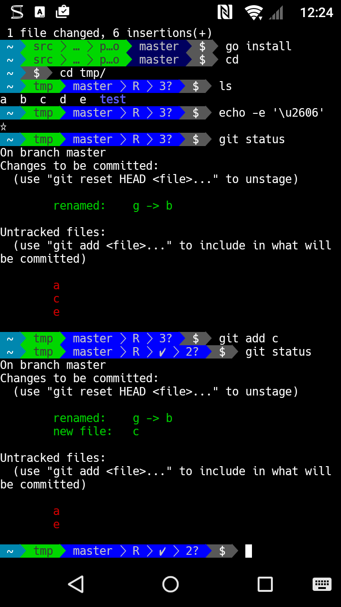

# powerline-shell-go

Attempted fork of [powerline-shell](https://github.com/milkbikis/powerline-shell) into [Go](http://golang.org/)

## Usage

Install the binary with

    go get -d github.com/scottweston/powerline-shell-go
    go install github.com/scottweston/powerline-shell-go

### Bash

Install powerline-shell-go and add the following to your `~/.bashrc`

    function _update_ps1() {
       export PS1="$(powerline-shell-go bash $? 2> /dev/null)"
    }

    export PROMPT_COMMAND="_update_ps1; $PROMPT_COMMAND"

### Zsh

Install powerline-shell-go and add the following to your `~/.zshrc`

    function powerline_precmd() {
      export PS1="$(powerline-shell-go zsh $? 2> /dev/null)"
    }

    function install_powerline_precmd() {
      for s in "${precmd_functions[@]}"; do
        if [ "$s" = "powerline_precmd" ]; then
          return
        fi
      done
      precmd_functions+=(powerline_precmd)
    }

    install_powerline_precmd

## Building

    $ make [all|linux|osx|windows|clean]

Resultant binaries can be found under the `build` directory. By default `make` will
build all variants for all OS types.

## Runtime enable/disable

The environment variable `LC_POWERLINE` is used to enable Powerline font support
or to fallback to a plain mode. In your `~/.ssh/config` add the following lines:

```
Host *
    SendEnv LC_*
```
And then on clients with Powerline fonts installed set the envvar `LC_POWERLINE` in
your shell of choice (e.g. `echo export LC_POWERLINE=1 >> ~/.bashrc`), this
way remote hosts can show fancy Powerline characters if your client supports it.

## Configuration

Configure the prompt via the file `~/.config/powerline-shell-go/config.json` and
override as many or as few options as you like:

```
{
  "showWritable": true,
  "showVirtualEnv": true,
  "showCwd": true,
  "cwdMaxLength": 10,
  "batteryWarn": 20,
  "showGit": true,
  "showHg": true,
  "showReturnCode": true,
  "icons": {
    "powerline": {
      "ahead": "\u21d1",
      "behind": "\u21d3",
      "branch": "\ue0a0",
      "conflicted": "\u203c",
      "detached": "\u2702",
      "ellipsis": "\u2026",
      "phases": "+",
      "readOnly": "\u2297",
      "removed": "\u2716",
      "separatorthin": "\ue0b1",
      "separator": "\ue0b0"
    },
    "plain": {
      "added": "A",
      "ahead": "^",
      "behind": "v",
      "branch": "B",
      "conflicted": "!",
      "detached": "x",
      "ellipsis": "...",
      "modified": "M",
      "phases": "+",
      "readOnly": "X",
      "removed": "D",
      "separatorthin": "/",
      "separator": "",
      "untracked": "?"
    }
  },
  "colours": {
    "hg": {
      "backgroundDefault": 22,
      "backgroundChanges": 64,
      "text": 251
    },
    "git": {
      "backgroundDefault": 148,
      "backgroundChanges": 161,
      "text": 16
    },
    "cwd": {
      "background": 245,
      "text": 237,
      "homeBackground": 220,
      "homeText": 15
    },
    "virtualenv": {
      "background": 35,
      "text": 15
    },
    "returncode": {
      "background": 196,
      "text": 16
    },
    "lock": {
      "background": 124,
      "text": 254
    },
    "dollar": {
      "background": 240,
      "text": 15
    }
  }
}
```

## Termux

Works just fine. You'll want to install
[Termux](https://play.google.com/store/apps/details?id=com.termux) and the
[Termux:Styling](https://play.google.com/store/apps/details?id=com.termux.styling)
apps to select a Powerline font and update your `~/.bash_profile` to include:

```
export LC_POWERLINE=1

function _update_ps1() {
  export PS1="$(powerline-shell-go bash $? 2> /dev/null)"
}

export PROMPT_COMMAND="_update_ps1; $PROMPT_COMMAND"
```


